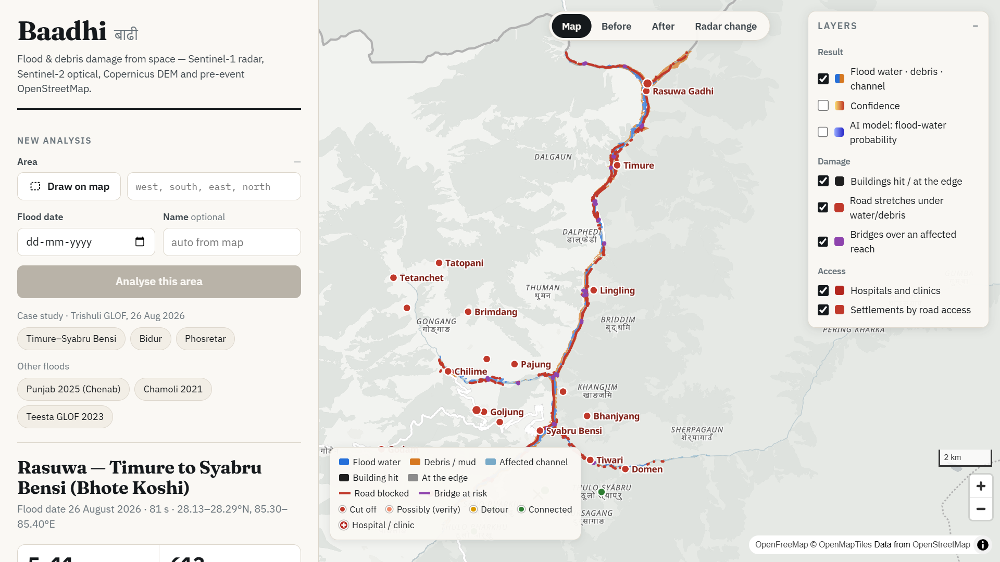

# Baadhi <sub>बाढी</sub> — flood & debris damage from space

**Pick an area and a flood date. Baadhi maps where flood water and debris hit, counts the buildings,
roads and bridges in its path, and finds the settlements cut off from hospitals — from raw satellite
data, in a few minutes, and writes a one-page situation report.**

Built for the IIT Mandi *Multimodal AI Hackathon 2026*, Track B "Mapping Flood Damage from Space".
Case study: the 26 August 2026 glacial-lake outburst on the Bhote Koshi–Trishuli (Nepal), checked
against Copernicus EMS activation **EMSR927**.



> Educational prototype — not an operational tool. Every result should be verified on the ground.

**Try it without installing anything:** **https://baadhi.pages.dev**. While the author's laptop is online it is the *complete*
dashboard — analyse any area and date (about 4–7 minutes, one analysis at a time), trace flood paths, open saved runs. When
the laptop is off, the same address shows eight saved analyses (the Trishuli glacial-lake flood and others) exactly as the
dashboard produces them. See *Public site* below for how this works and its limits.

---

## What it answers

| Question | How | Output |
|---|---|---|
| **Where did the flood and debris hit?** | Sentinel-1 radar before/after (every usable orbit track), Sentinel-2 optical before/after when the sky is clear, a flood segmentation model, terrain rules from the Copernicus DEM | map of *flood water*, *debris / mud / scoured ground* and the *affected river channel*, with a confidence layer |
| **What was damaged?** | overlay on OpenStreetMap **as it was before the event** | buildings hit / at the edge, road stretches under water or debris, bridges over an affected reach, health facilities |
| **Who is cut off?** | road routing before vs after, to the nearest hospital/clinic and town (network extends 25 km beyond the area) | each settlement: *cut off* / *long detour* / *connected*, minutes before and after, and whether it is still reachable on foot |
| **Bonus: where would a flood go?** | steepest-descent flow path on the Copernicus DEM from any upstream point | the path and the settlements along it, with distance downstream and height above the river |

All of it lands in a **map dashboard** and a **one-page situation report** (HTML + PDF) where every
number comes from the maps — nothing is typed in by hand.

## Data — and the rules we keep

| Input | Used for | Source (no account needed) |
|---|---|---|
| Sentinel-1 GRD, radiometrically terrain-corrected (γ⁰) | change and water detection, the flood model | Microsoft Planetary Computer `sentinel-1-rtc` |
| Sentinel-2 L2A | optical change (vegetation stripped, fresh sediment, new water) | Planetary Computer `sentinel-2-l2a` |
| Copernicus DEM GLO-30 / GLO-90 | height above river, slopes, radar blind spots, flood path | Planetary Computer `cop-dem-glo-30`, `cop-dem-glo-90` |
| OpenStreetMap **before the event** | buildings, roads, bridges, places, health facilities | Overpass API "attic" query at *event date − 2 days, 00:00 UTC*; if that server is slow, the newest dated Geofabrik regional snapshot *before* the event |
| Kuro Siwo (training only) | training the flood model | Kuro Siwo dataset (CC BY 4.0) |

**Never used as inputs:** Copernicus EMS, UNOSAT or any other published flood/damage map, and OSM
edits made after the event. EMS maps (EMSR927, EMSR838) are used **only to score results**; that code
lives in `experiments/` and nothing in the `baadhi` package imports it. No detector threshold was fitted
to EMS data (see *Honesty notes*).

## How it works

```
area + date ─┬─ Sentinel-1 stacks (per track: up to 3 before, first after) ──┐
             ├─ Sentinel-2 clear-pixel composites before / after ─────────────┤
             ├─ Copernicus DEM → height above river, slope, radar geometry ──┤──► detector ──► flood water / debris / channel
             └─ OSM snapshot before the event ───┐                           │        ▲
                                                 │   flood model (U-Net) ────┘────────┘
                                                 ├──► damage: buildings, roads, bridges, health facilities
                                                 └──► access: routing before/after → cut-off settlements ──► dashboard + one-page report
```

1. **Radar change** — for every orbit track: γ⁰ log-ratio after/before, divided by each pixel's own
   pass-to-pass variability; layover and shadow masked from the DEM and the satellite's viewing geometry.
2. **Optical change** — clear pixels only (scene classification mask): vegetation index drop, bare-soil
   and brightness rise, new water. Where Sentinel-2 saw the ground clearly and unchanged, radar noise
   (e.g. a maize harvest) cannot overrule it.
3. **Flood model** — flood-water probability from the segmentation network (below).
4. **Detector** — physical rules with fixed thresholds: terrain gates (height above the main river,
   slope), clean-up, connection to the river corridor, and filling valley floor below the observed flood
   level where clouds or radar shadow hid the ground.
5. **Damage and access** — footprints on the pre-event OSM; routing on the road graph with the cut
   stretches and at-risk bridges removed; walking paths as a separate "on foot" layer. A settlement that is
   still linked only through roads touching the footprint or running within 20 m of it is flagged
   **possibly cut off — verify** (a 10 m map cannot place the footprint's edge exactly, and bank roads get undercut).

### The AI component: a flood segmentation model

- **Task:** per-pixel *no water / permanent water / flood water* from Sentinel-1 (VV, VH) after and
  before the event plus slope and relative height from the DEM (8 channels).
- **Network:** U-Net with a ResNet-18 encoder, **trained from scratch** on Kuro Siwo only (no ImageNet
  weights, so no data outside the allowed lists), on a laptop CPU.
- **Training data:** Kuro Siwo GRD, official event splits; four training events from different climates
  moved to validation; **official test events never seen**, including the Nepal event (1111007).
- **Live data made to look like the training data:** Planetary Computer gives terrain-flattened γ⁰
  without speckle filtering, Kuro Siwo is σ⁰ with a Lee filter — so live images are converted
  (σ⁰ ≈ γ⁰·cos θ) and Lee-filtered before the same feature code runs (`baadhi/ml/features.py`).
- **Deployment:** exported to ONNX (`models/flood_model.onnx`), run with onnxruntime — identical
  output to PyTorch, 1.6× faster; the dashboard does not need PyTorch.

**Results on data the model never saw.** Which checkpoint to deploy was fixed before any evaluation: the final
one (epoch 30 of 30, averaged weights). Validation flood F1 peaks early (0.662 at epoch 2) and then stays within
0.647–0.662, while the IoU of "any water after the event" keeps rising (0.65 → 0.71) and so does the IoU of the
permanent-water class (0.29 → 0.36) — so we did not stop early. For transparency the table also shows the
best-validation checkpoint (epoch 2).

| Test (flood F1) | Plain radar rule | **Model, final epoch (deployed)** | Model, epoch 2 |
|---|---|---|---|
| **Kuro Siwo official test events** — 8,450 tiles from 5 events, pooled | 0.709 | **0.782** | 0.729 |
| · Nepal 1111007, Koshi plains (2,318 tiles) | 0.632 | 0.776 | 0.764 |
| · USA 1111013 (6,000 tiles) | 0.774 | 0.800 | 0.714 |
| · 561 / 1111002 (38 / 27 tiles) | 0.737 / 0.485 | 0.885 / 0.786 | 0.880 / 0.672 |
| · **562 (67 tiles) — the model loses** | 0.663 | **0.389** | 0.431 |
| **Live Sentinel-1, EMSR838 Punjab floods** — 4 areas, mean | 0.522 | **0.774** | 0.802 |
| · AOI01 Rasoo Nagar (143 km² flooded) | 0.631 | 0.932 | 0.945 |
| · AOI02 Sharaqpur (65 km²) | 0.313 | 0.890 | 0.906 |
| · AOI04 Najabat (26 km²) | 0.849 | 0.882 | 0.895 |
| · AOI05 Trimmu (9 km², braided river) | 0.296 | 0.391 | 0.463 |

The model beats the rule on four of the five unseen Kuro Siwo events and on all four Punjab areas. On event 562 it
labels 70 % of the flood pixels as *permanent* water (the before-images already showed water), so it misses most of
the flood there. The live tests use exactly the Sentinel-1 pass EMS mapped from and score only inside the EMS area of
interest; the rule is scored with permanent water counted as "not flood", the easier case for it.

## Case study: Trishuli GLOF, 26 Aug 2026 vs Copernicus EMSR927

EMSR927 areas 1–3 were used while developing the detector; **area 5 (Phosretar) was held out** of its tuning.
The numbers are for the deployed system (physical rules + flood model — the model never saw EMSR927 or any other EMS
map) with OpenStreetMap as of 24 Aug 2026.

| Area | Flood/debris map: precision · recall · F1 | Buildings EMS graded damaged/destroyed that we flag | Damaged road length inside our footprint | Damaged bridges we flag (of those in OSM) |
|---|---|---|---|---|
| AOI 1–2 Syabru Bensi–Timure (dev) | 0.99 · 0.82 · 0.90 | 94 % | 87 % | 5 / 5 |
| AOI 3 Bidur (dev) | 0.95 · 0.90 · 0.92 | 95 % | 85 % | 20 / 20 |
| **AOI 5 Phosretar (held out)** | **0.86 · 0.93 · 0.89** | **80 %** | **77 %** | **30 / 30** |

The rule-only detector (no flood model) scored 0.99 · 0.81 · 0.89, 0.97 · 0.88 · 0.92 and, on Phosretar, 0.97 · 0.77 · 0.86
(buildings 63 %, roads 55 %, bridges 24 / 30): the flood model adds recall in the wide, braided reach at Phosretar at some
cost in precision. Without any OpenStreetMap at all (rivers taken from the terrain only) the map still scores F1 0.89 at
Bidur and 0.90 at Phosretar, but counts no buildings, roads or settlements.

In the upper valley the Pasang Lhamu highway is blocked in many places: **22 settlements lose their
road link to the nearest hospital or town** (Syabru Bensi had a clinic 24 minutes away before the event).

**Is the cut-off list right?** The same routing, run with roads cut where *EMS* graded them damaged instead of
by our footprint, gives the same status for **30/30** settlements in the upper valley and **89/89** at Bidur
(development areas), and **93/101 (92 %)** in the held-out Phosretar area. There EMS-based routing cuts off 17
settlements: we call 11 of them cut off and flag the other 6 as *possibly cut off — verify*; EMS-based routing still
finds a road for 2 settlements that we call cut off. (23 % of the damaged road length there lies outside our footprint.)

## Setup

**Prerequisites:** Python 3.12, about 5 GB free disk for caches, an internet connection (satellite
data and OpenStreetMap are read on demand). Optional: Google Chrome or Microsoft Edge, used to print the
report to PDF. No GPU and no accounts are needed.

```bash
git clone https://github.com/25x55a0405-glitch/baadhi.git
cd baadhi
python -m venv .venv
# Windows: .venv\Scripts\activate      macOS/Linux: source .venv/bin/activate
pip install numpy scipy "rasterio>=1.4" "shapely>=2.0" pyproj networkx pysheds requests pystac-client planetary-computer scikit-image pillow matplotlib fastapi "uvicorn[standard]" onnxruntime osmium
```

(`pip install -r requirements.txt` also installs PyTorch and friends — only needed to retrain the model.)

## Run

**Dashboard**

```bash
python serve.py
```

Open http://127.0.0.1:8765 (the program prints the address; it takes the next free port if 8765 is busy), then either click a case-study area or *Draw on map*, choose the flood
date and press **Analyse this area**. On this laptop (no GPU) a new area of 150–250 km² took 4–5 minutes when the
public OpenStreetMap server answered quickly (measured cold: Silchar 250 s, Melamchi 286 s — radar and optical downloads
1½–2 min, the rest is compute). In dense areas that server needs 10–15 minutes for the pre-flood map, so the system cuts the area out
of a Geofabrik snapshot instead (about 5 minutes the first time, cached afterwards). With everything cached an
analysis takes 1–2 minutes. Then use *Before / After / Radar change* to
see the evidence, click settlements for travel times, download the report or the map data, and use
*Where would a flood go?* to trace a flood path from any point.

**Command line**

```bash
python -m baadhi.runner 85.30 28.13 85.40 28.29 2026-08-26 --name "Rasuwa — Bhote Koshi"
```

writes a run folder under `runs/` (GeoTIFFs, GeoJSON layers, `stats.json`, `sitrep.html/pdf`) that the
dashboard also lists.

**Public demo** (plain files, e.g. Cloudflare Pages)

```bash
python experiments/export_static.py --out site       # freezes the saved analyses into plain files (needs a few saved runs)
wrangler pages deploy site --project-name baadhi --branch main
```

**Checks and training** (need the full `requirements.txt`)

```bash
python -m baadhi.preflight                         # data sources reachable?
python experiments/eval_detect.py upper            # detector vs EMSR927 (checking only)
python experiments/eval_damage.py phosretar        # buildings / roads / bridges vs EMSR927
python experiments/eval_live_water.py              # flood model on live Sentinel-1 vs EMSR838
python -m baadhi.ml.train --model resnet18 --epochs 30 --crops 3000 --lr 1e-3 --name main
python -m baadhi.ml.evaluate models/runs/main/best.pt      # Kuro Siwo test events
python -m baadhi.ml.infer export models/runs/main/best.pt models/flood_model.onnx
```

## Public site

`baadhi.pages.dev` is a Cloudflare Pages site with one small worker (`experiments/pages_worker.js`) in front of it:

- **Live** — `scripts\go-live.ps1` starts the real server in public mode (`BAADHI_PUBLIC=1`), opens a free Cloudflare quick
  tunnel to it (`wrangler tunnel quick-start`), and writes the tunnel's address to a Cloudflare KV key. The worker relays
  every request to that address, so visitors get the full app. The tunnel address changes at each start; `baadhi.pages.dev` does not.
- **Demo** — when the engine is off (`scripts\stop-live.ps1`, a shut laptop, a lost connection) the worker serves the static
  export of eight saved analyses (`experiments/export_static.py`), so the link is never dead.
- **Fair use** — a public engine on one laptop needs limits: 3 analyses per hour and 10 per day per visitor, 8 flood-path
  traces per hour, at most 4 analyses waiting in line; saved analyses are unlimited. The worker passes the visitor's address in a header
  signed with a secret shared with the server (`.work/live/edge_token.txt`, never committed); the owner's own browser is never limited.
  The server runs at below-normal priority and the laptop is kept awake only while live.

```
powershell -ExecutionPolicy Bypass -File scripts\go-live.ps1     # online (about a minute)
powershell -ExecutionPolicy Bypass -File scripts\stop-live.ps1   # offline; the demo takes over at once
wrangler pages deploy site --project-name baadhi --branch main   # after python experiments/export_static.py
```

To deploy under your own Cloudflare account, create a KV namespace (`wrangler kv namespace create baadhi-live`) and put its id in `wrangler.toml`.

## Repository layout

```
baadhi/            the system
  pipeline.py      area + date → maps, damage, access (parallel downloads)
  sar.py optical.py terrain.py detect.py damage.py access.py flowpath.py
  report.py        one-page situation report · render.py map overlays
  server.py        dashboard API · runner.py one complete analysis
  ml/              features, network, Kuro Siwo conversion, training, evaluation, inference (ONNX)
  sources/         Planetary Computer; OpenStreetMap pre-event snapshot (Overpass history, Geofabrik fallback)
web/               dashboard (MapLibre GL, no build step)
experiments/       evaluation against EMS maps (checking only), figures, the demo-video builder
models/            flood_model.onnx + its config
examples/          a real situation report and layers (Trishuli, 26 Aug 2026) to browse without running anything
docs/              report (PDF), Devpost text, demo runbook, Q&A preparation, figures
serve.py           start the dashboard
```

## Honesty notes and limitations

- **Revisit gaps.** Sentinel-1 passes every 6–12 days per track; water that drained before the first
  pass after the event is not seen. Nothing here predicts a flood before it happens.
- **Radar blind spots.** Steep slopes facing towards or away from the satellite (layover, shadow) are
  masked; optical images need clear sky, which the monsoon rarely gives.
- **"Hit" is not "destroyed".** At 10 m a building inside the footprint may still stand. EMS grades
  damage from very-high-resolution images; we flag exposure.
- **OpenStreetMap completeness.** Unmapped buildings, roads, bridges and villages are not counted; 9 of
  the 39 bridges EMS graded at Phosretar are not in OSM at all.
- **Travel times** use typical speeds per road class; roads beyond the analysed area are assumed passable.
- **OpenStreetMap history comes from the public Overpass server**, which can be slow at busy hours. All
  map layers are fetched in one query per area. If it has not answered after a minute, the newest dated
  Geofabrik regional snapshot from *before* the event (1st of recent months, 1 January of earlier years) is cut
  out locally in parallel and the first complete source is used — the report says which one and its date. If
  neither is ready after 10 minutes, the flood/debris map is delivered anyway and damage/access are marked as
  not computed; the downloads continue and are cached, so running the same area again completes them.
- **Where it was tuned.** Detector thresholds are physical and fixed; they were checked on EMSR927 areas
  1–3, which therefore count as development areas. Area 5 (Phosretar) was held out of that tuning: we first scored
  the rule-only detector there and later the deployed system once the flood model was added — both results are shown
  above, and nothing was chosen from them. The flood model never saw EMS data; on EMSR838 it is an independent
  test, while two rules for plains (model water not forced to touch the river corridor; unknown height-above-river
  accepted on flat ground) were added after looking at AOI01, so the *combined* detector's EMSR838 numbers
  (mean F1 0.78) are a development check.
- **The model can mistake new flood water for permanent water** (Kuro Siwo event 562: F1 0.39 against 0.66 for the
  plain rule). The physical rules and the optical evidence still contribute to the final map, but where the
  before-images already show water, treat the flood extent as a lower bound.
- **Kuro Siwo's Nepal event is in the Koshi plains**, not the mountains; mountain performance is shown
  on the EMSR927 case study.

## License

Code: MIT (see `LICENSE`). The flood model's weights were trained on Kuro Siwo (CC BY 4.0) and map data are
© OpenStreetMap contributors (ODbL) — see *Attribution* below.

## Attribution

- Contains modified Copernicus Sentinel data 2026 (and 2025 for the EMSR838 tests), processed by
  Microsoft Planetary Computer.
- Copernicus DEM: produced using Copernicus WorldDEM-30 © DLR e.V. 2010–2014 and © Airbus Defence and
  Space GmbH 2014–2018 provided under COPERNICUS by the European Union and ESA; all rights reserved.
- © OpenStreetMap contributors, ODbL — pre-event snapshots via the Overpass API and Geofabrik regional extracts.
- Kuro Siwo: N. I. Bountos, M. Sdraka, A. Zavras, et al., *Kuro Siwo: 33 billion m² under the water. A
  global multi-temporal satellite dataset for rapid flood mapping*, NeurIPS 2024 Datasets and Benchmarks
  (CC BY 4.0).
- Checking only: Copernicus Emergency Management Service © European Union — EMSR927, EMSR838.
- Basemap: © OpenFreeMap, © OpenMapTiles, data © OpenStreetMap contributors.
- Map library: MapLibre GL JS (BSD-3-Clause).
